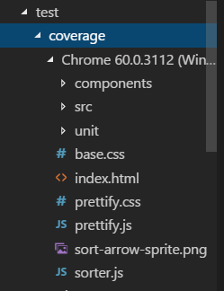
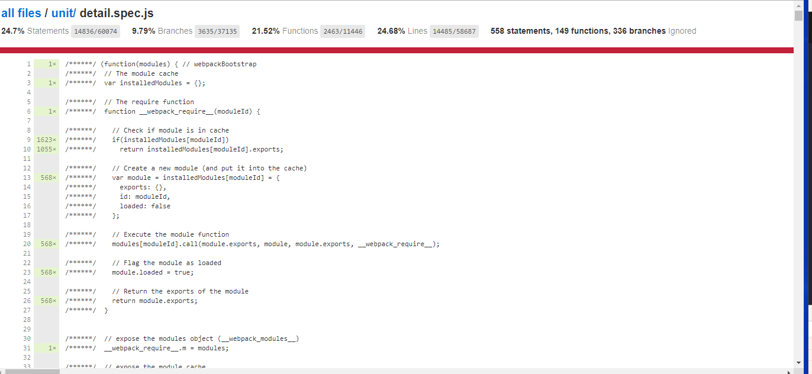
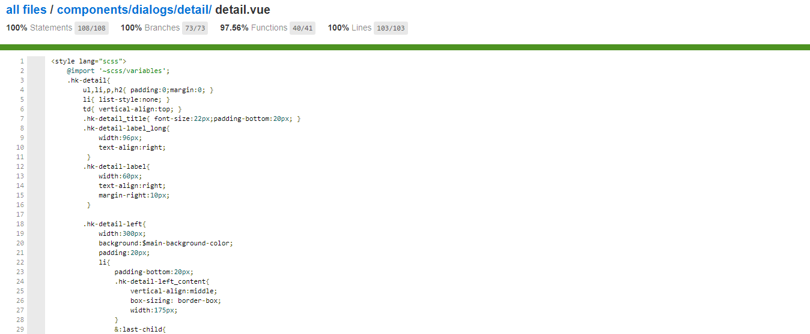
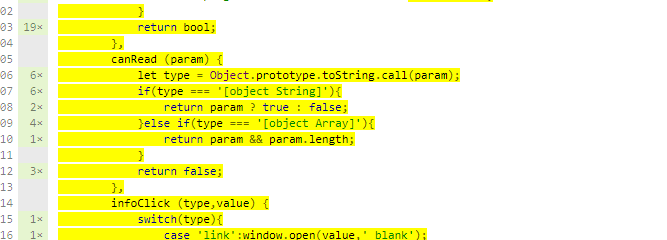

单元测试，在维基百科中解释是：在计算机编程中，单元测试（英语：Unit Testing）又称为模块测试, 是针对程序模块（软件设计的最小单位）来进行正确性检验的测试工作。 程序单元是应用的最小可测试部件。 在过程化编程中，一个单元就是单个程序、函数、过程等；对于面向对象编程，最小单元就是方法，包括基类（超类）、抽象类、或者派生类（子类）中的方法。而vue单元测试在我看来就是为了隔离应用部件并证明这些单个vue组件是正确的，以在开发过程的早期就能发现问题，提高代码质量和可维护性，从而有效的减少维护成本，降低 Bug 率。
***
## 1.准备工作

整理一下配置测试环境所需要的依赖：
```javascript
    karma //test runner，提供测试所需的浏览器环境、监测代码改变自动重测、整合持续集成等功能
    phantomjs-prebuilt //phantomjs，在终端运行的浏览器虚拟机，也可以直接使用了chrome
    mocha //test framework，测试框架，运行测试
    chai //assertion framework, 断言库，提供多种断言，与测试框架配合使用
    sinon //测试辅助工具，提供 spy、stub、mock 三种测试手段，帮助捏造特定场景
    karma-webpack //karma 中的 webpack 插件， 连接karma和webpack的桥梁。不经过webpack编译命令是文件是无法独立运行的，karma需要了解你的webpack配置，决定如何处理你的测试文件。
    karma-mocha //在karma 中使用 mocha测试框架的 插件
    karma-sinon-chai //在karma 中使用 sinon-chai断言库的 插件
    sinon-chai //karma 中的 chai 插件
    karma-sourcemap-loader //karma 中的 sourcemap 插件
    karma-phantomjs-launcher //karma 中的 phantomjs 插件,如使用chrome为测试浏览器则为karma-chrome-launcher
    karma-spec-reporter //在终端输出测试结果的插件
    karma-coverage //代码覆盖率统计工具coverage
```
要在karma使用某个测试工具都需要安装karma对应的插件。
相关配置安装一波
```javascript
npm i karma mocha chai sinon karma-webpack karma-mocha karma-sinon-chai sinon-chai karma-sourcemap-loader karma-chrome-launcher karma-spec-reporter karma-coverage --save-dev
```
安装好了，可以先跑一下看看是否安装正确，到package.json的scripts中注册一个命令："unit": "cross-env BABEL_ENV=test karma start karma.conf.js --single-run"，然后运行。

## 2. 配置 karma

按照 karma 的文档，运行：karma init。因为karma是要在命令中运行的，所以需要先安装karma-cli：npm install -g karma-cli。这时可以选择使用的测试框架、是否使用 require.js、浏览器环境、测试脚本存放位置、是否有需要 ignore 的文件，等等。选择完毕之后，该项目根目录下生成名为 karma.conf.js 文件。
修改Karma配置：
打开karma.config.js文件，引入webpack，并配置webpack加载 .js、.vue、babel；这和普通的 webpack 配置没什么差别，除了 entry 之外，resolve、各种 loader 等等都需要加上.
最终的karma配置如下：
```javascript
// Karma configuration
var webpack= require('webpack');
var path= require('path');
module.exports = function(config) {
    config.set({
        // 文件匹配的起始路径
        basePath: '',
        // 测试框架
        // available frameworks: 	https://npmjs.org/browse/keyword/karma-adapter
        frameworks: ['mocha','chai'],
        // 要测试的目标文件
        files: [
            'test/unit/**/*.spec.js'
        ],
        // 忽略的文件
        exclude: [
        ],
        // 预处理文件
        // available preprocessors: 	https://npmjs.org/browse/keyword/karma-preprocessor
        preprocessors: {
            'test/unit/**/*.spec.js':['webpack','coverage']
        },
        //karma的watch模式,即自动化测试
        autoWatch:true,
        // 测试报告处理
        // available reporters: 		https://npmjs.org/browse/keyword/karma-reporter
        reporters: ['spec','progress','coverage'],
        /测试覆盖率文件输出
        coverageReporter: {
            type: 'html',
            dir: 'test/coverage/'
        },
        // 服务器端口
        port: 9876,
        // 输出着色
        colors: true,
        // 日志级别
        // LOG_DISABLE || LOG_ERROR || LOG_WARN || LOG_INFO || LOG_DEBUG
        logLevel: config.LOG_INFO,
        //监控文件更改
        autoWatch: true,
        // 要启动的测试浏览器
        // available browser launchers: 		https://npmjs.org/browse/keyword/karma-launcher
        browsers: ['Chrome'],
        // true: 自动运行测试并退出
        // false: 监控文件持续测试
        singleRun: false,
        // Concurrency level
        // how many browser should be started simultaneous
        concurrency: Infinity,
        // 超时处理，6s内没有捕获浏览器将终止进程
        // captureTimeout: 6000
        // 手动引入 karma 的各项插件，如果不显式引入，karma 也会自动寻找 karma- 开	头的插件并自动引入
        //plugins: [],
        // webpack
        webpack: {
            module: {
                loaders: [
                {
                    test: /\.vue$/,
                    loader: 'vue'
                },{
                    test: /\.(sass|scss|css)$/,
                    loaders: ['style', 'css', 'sass']
                },{
                    test: /\.(woff|woff2|eot|ttf|svg)/,
                    loader: 'file?name=fonts/[name].[ext]'
                },{
                    test: /algeria\.json/,
                    loader: 'file?name=[name].[ext]'
                },{
                    test: /sigma/,
                    loader: 'imports-loader?this=>window'
                },{
                    test: /\.js$/,
                    loader: 'babel?cacheDirectory=.babel_cache',
                    exclude:/libs|node_modules|vue\/dist|vue-router\/|vue-loader\/|vue-hot-reload-api\//
                }]
            },
            vue: {
                loaders: {
                    js: 'babel?cacheDirectory=.babel_cache',
                    css: 'vue-style!css',
                    sass: 'vue-style!css!sass',
                    scss: 'vue-style!css!sass'
                }
            },
            resolve: {
                extensions: ['', '.js', '.vue'],
                modulesDirectories: ['node_modules'],
                alias: {
                    vue: 'vue/dist/vue.js', // independent render,
                    scss: path.resolve(__dirname, './src/scss'),
                    mixins: path.resolve(__dirname, 'src', 'mixins'),
                    components: path.resolve(__dirname, 'src', 'components')
                }
            }
        }
    })
}
```

## 3.规划目录结构

├── src/
│
├── test/
     └── coverage/
│   └── unit/
│       └── *.spec.js
└── karma.conf.js
测试的项目源代码主要处于src中。测试相关文件均放在 test/unit 文件夹下，各个组件的单元测试文件分别为 组件名.spec.js。coverage文件夹是运行命令后自动生成的覆盖率文件夹，它默认产生在项目目录下的，这里为了不影响项目代码结构，我把karma.config.js文件里的coverageReporter生成路径修改为了“test/coverage/”，让它在test文件下生成。

## 4.编写组件测试代码

在编写测试代码前，简单介绍下测试框架mocha和断言chai。

### Mocha
http://www.ruanyifeng.com/blog/2015/12/a-mocha-tutorial-of-examples.html
mocha编写的测试用例主要由describe和it组成。测试脚本里面应该包括一个或多个describe块，每个describe块应该包括一个或多个it块。 describe块称为"测试套件"（test suite），表示一组相关的测试。它是一个函数，第一个参数是测试套件的名称，第二个参数是一个实际执行的函数。 it块称为"测试用例"，表示一个单独的测试，是测试的最小单位。它也是一个函数，第一个参数是测试用例的名称，第二个参数是一个实际执行的函数。如：
```javascript
describe('new-thumbnail', () => {
    it('create', done => {

    })
})
```
由于Vue进行异步更新DOM的情况，一些依赖DOM更新结果的断言必须在 Vue.nextTick 回调中进行：并且需要在it语句传入done，在回调结束的时候执行done().如：
```javascript
it('test computed', done => {
    Vue.nextTick(() => {
        expect(vm.visible).to.equal(true);
        done()
    })
})
```
mocha在describe块之中，提供测试用例的四个钩子：before()、after()、beforeEach()和afterEach()。它们会在指定时间执行。
```javascript
describe('hook', () => {
    before(function() {
    // 在本区块的所有测试用例之前执行
    })
    after(function() {
        // 在本区块的所有测试用例之后执行
    })
    beforeEach(function() {
        // 在本区块的每个测试用例之前执行
    })
    afterEach(function() {
        // 在本区块的每个测试用例之前执行
    })
})
```

### Chai
http://chaijs.com/api/
所谓"断言"，就是判断源码的实际执行结果与预期结果是否一致，如果不一致就抛出一个错误。这里用的断言库是chai，其中有三个API expect/should/assert，比较常用的是expect。详细可以看chai的相关api。如下面的这句断言意思就是vm.visible的值应该是true。
```javascript
expect(vm.visible).to.equal(true);
```

### 测试
主要就是在unit文件夹下建立对应组件的*.spec.js文件，并在该文件中写各种测试用例，开始时首先需要在文件头引入组件所引用的各种依赖，如组件中使用了element组件：
```javascript
import Vue from 'vue'
import ElementUI from 'element-ui'
Vue.use(ElementUI);
```

1.一般组件的测试可以直接使用定义好的createTest工具函数（见5）来直接创建测试组件实例，然后就可以对实例进行模拟操作，断言其期望值是否达到预期。不符合的话，会在控制台输出相应的错误，从而了解到该方法不能达到预期，存在着问题。
```javascript
vm = createTest(NewThumbnail, true);

describe('测试组件detail.vue不涉及store的methods', () => { 
    it('test methods without store', done =>{
        expect(true).to.equal(false);
    })
})
```


2.如果组件应用到store进行状态管理，则需要引入store文件，可在创建测试组件实例构造器Vue.extend时传入store，才能在测试实例中使用。在测试detail组件中，打开不同模块的详情都需要调用store里的 showDetail mutation，并传入不同的参数。为了能在测试不同详情信息的输入结果是否达到预期，我一般都选择在每个describe块的before钩子函数进行commint。
```javascript
//构造一个传入store的vue组件构造函数
var ctsr=Vue.extend({
    store
})
var vm= new ctsr(detail); 

//moduleType:'program' 
describe('moduleType为program时detail.vue methods', () => { 
    before(function() {
// 在本区块的所有测试用例之前执行
        vm.$store.commit('showDetail',{
            id:'program1',
            rowData:{'a': 1},
            moduleType:'program',
            hasButton:true,
            processAuth:'va.video.programGetEvidence.search.detail.process',
            createWritAuth:'va.video.programGetEvidence.search.detail.createWri',
        })
    });
    ...
})    

```

3.如测试的组件涉及到异步ajax请求，可以安装mockJs，使用mockJs来拦截请求，并返回一些模拟数据，来判断数据是否达到预期。
```javascript
Mock.mock("/hawkeye/va/video/programMonitor/processall",function(res){
    return {
        "code": 0,
        "msg": "节目直接处理",
        "data": {
          "status": 0
        }
    } 
})
```

4.测试结果查看：测试结果主要在终端查看，可以看到相关的断言是否正确。如配置了coverage插件，则会在相应的目录下生产coverage文件夹，具体的目录结果如下：打开index.html文件即可查看到代码的覆盖率等相关信息。


但是我发现打开的index文件这里的detail.spec.js，默认是编译之后的文件，所以，测试覆盖率就是打包编译后的覆盖率，这并不是我想要的。


经过网上的查找之后，发现需要另外另外安装两个模块：sourcemap 与 isparta,去掉karma.comfig.js里面的preprocessors中的coverage设置，同时需要修改vue的js loader。
sourcemap 是资源定位的模块
isparta 计算测试覆盖率

npm install --save-dev sourcemap isparta isparta-loader
```javascript
// 预处理文件
// available preprocessors: https://npmjs.org/browse/keyword/karma-preprocessor
preprocessors: {
    'test/unit/**/*.spec.js':['webpack']
},

vue: {
loaders: {
    js: 'isparta-loader',
...
}
},
isparta: {
    emBedSource: true,
    noAutoWrap: true,
    babel: {
        presets: ['es2015']
    }
},
```
再运行测试命令，这时打开index.html，显示如下：


detail.vue即是要测试的组件，该文件中代码部分按照“绿色”，“黄色”和“红色”进行分类。“绿色”表示没有静态错误的代码；“黄色”表示可能存在错误的代码，需要重新测试；“红色”表示肯定没有测试到的代码。这样，我可以集中精力编写“红色”代码测试，重点测试“黄色”代码。


5.在编写测试代码过程，可以直接参考了ElementUi组件库测试的一个工具函数做了简单的修改，在test文件夹新建了一个util.js的文件来存放几个工具函数，辅助生成测试组件实例。如：
```javascript
/**
 * 创建一个 Vue 的实例对象
 * @param  {Object|String}  Compo   组件配置，可直接传 template
 * @param  {Boolean=false} mounted 是否添加到 DOM 上
 * @return {Object} vm
 */
exports.createVue = function(Compo, mounted = false) {
  if (Object.prototype.toString.call(Compo) === '[object String]') {
    Compo = { template: Compo };
  }
  return new Vue(Compo).$mount(mounted === false ? null : createElm());
};
```

```javascript
/**
 * 创建一个测试组件实例
 * @link http://vuejs.org/guide/unit-testing.html#Writing-Testable-Components
 * @param  {Object}  Compo          - 组件对象
 * @param  {Object}  propsData      - props 数据
 * @param  {Boolean=false} mounted  - 是否添加到 DOM 上
 * @return {Object} vm
 */
exports.createTest = function(Compo, propsData = {}, mounted = false) {
  if (propsData === true || propsData === false) {
    mounted = propsData;
    propsData = {};
  }
  const elm = createElm();
  const Ctor = Vue.extend(Compo);
  return new Ctor({ propsData }).$mount(mounted === false ? null : elm);
};
```

通过 createTest 和 createVue 两个函数就可以很灵活的生成.vue这种单文件组件和自定义标签的组件的 Vue 实例，然后模拟各种操作来执行单元测试。另外还有模拟鼠标、键盘点击事件triggerEvent/triggerClick的也放在了util.js里。

## 5.结语

由于本人第一次接触vue单元测试，在编写测试代码的过程中都是摸索着写的，有写的不对的地方，欢迎大家批评指正，多多指导。


